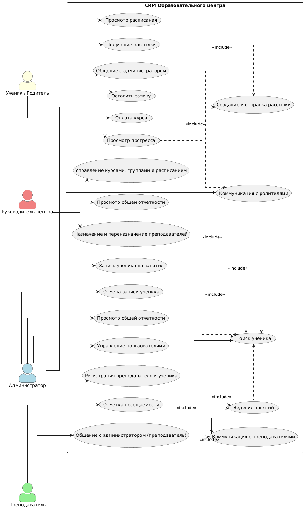
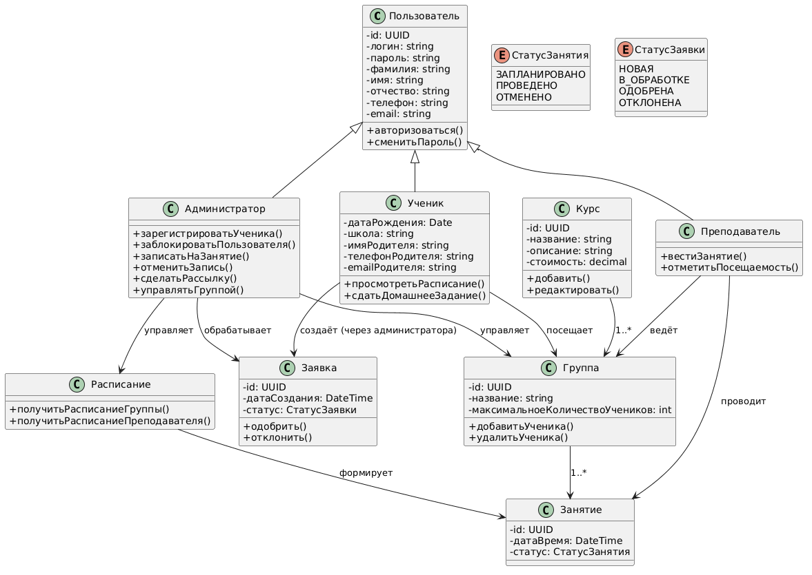
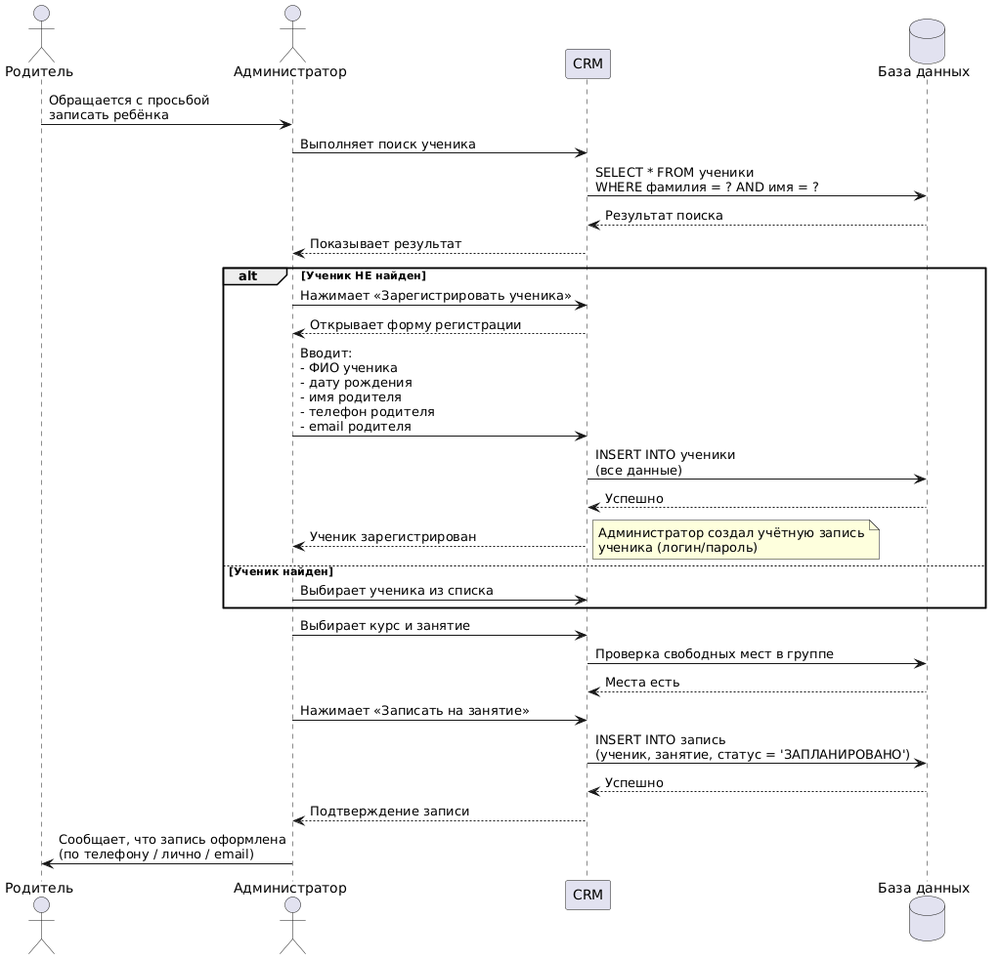
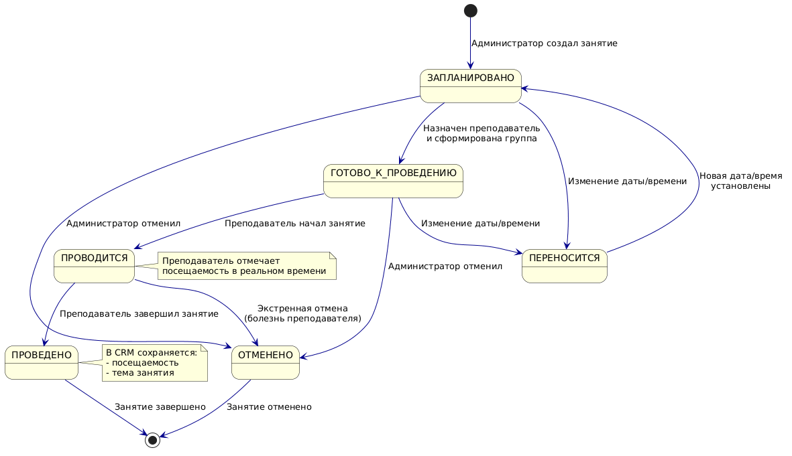
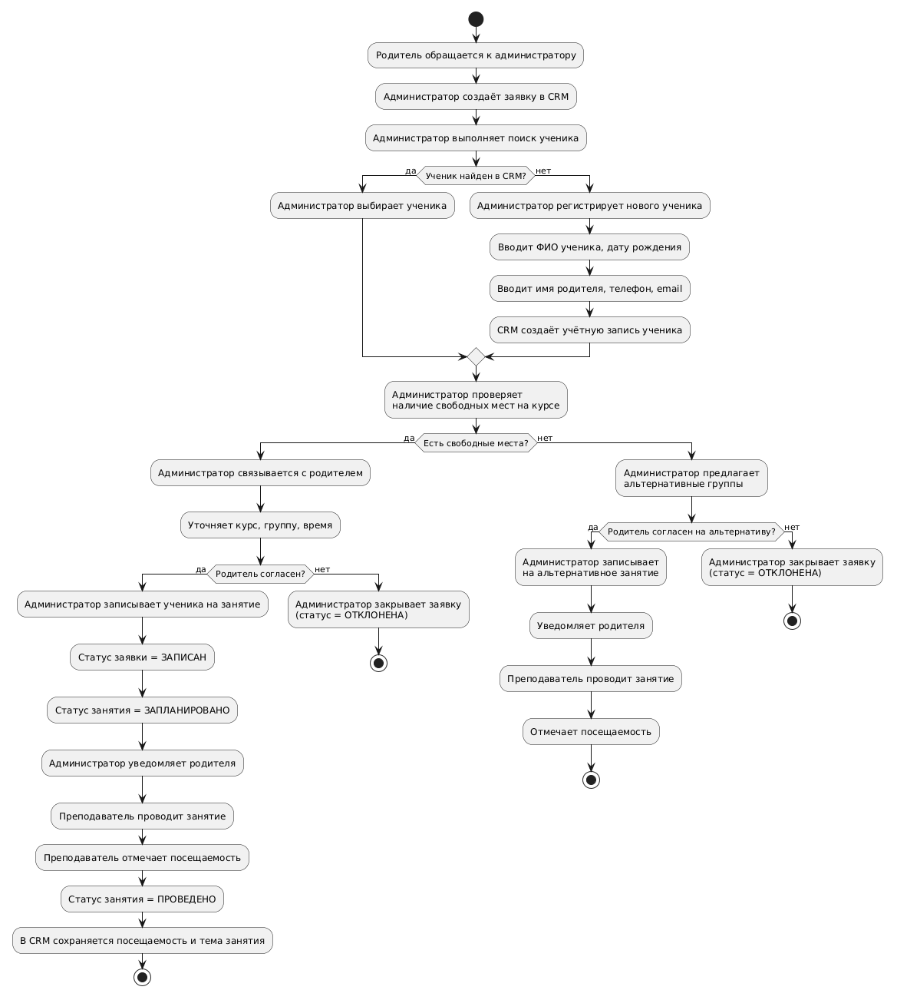

# Диаграммы UML

Тема ВКР: *«Разработка информационной системы для автоматизации бизнес-процессов образовательного центра»*

---

## 1. Диаграмма вариантов использования (Use Case Diagram)

**Назначение:** Определение функциональных требований к системе и выделение ролей.

**Ключевые роли:**
- Администратор
- Преподаватель
- Ученик / Родитель
- Руководитель центра

**Основные функции:**
- Администратор: регистрация учеников, запись/отмена на занятия, коммуникация, рассылки.
- Преподаватель: ведение занятий, отметка посещаемости.
- Ученик/Родитель: просмотр расписания, прогресса, оплата, общение с администратором.
- Руководитель: управление курсами и расписанием, назначение преподавателей, отчётность.

**Вывод:** Диаграмма отражает все ключевые бизнес-процессы и разграничение прав доступа.

---

## 2. Диаграмма классов (Class Diagram)

**Назначение:** Описание статической структуры системы — классов, атрибутов, методов и связей.

**Основные сущности:**
- `User` — базовый класс
- `Administrator`, `Teacher`, `Student` — наследники
- `Course`, `Group`, `Lesson` — учебная структура
- `Schedule` — расписание
- `Request` — заявка на обучение

**Вывод:** Диаграмма соответствует use case и обеспечивает основу для реализации на Python.

---

## 3. Диаграмма последовательности (Sequence Diagram)

**Назначение:** Детализация сценария «Запись ученика на занятие».

**Участники:** Родитель, Администратор, CRM, БД.

**Основной поток:**
1. Родитель обращается к администратору.
2. Администратор ищет ученика.
3. Если не найден — регистрирует (ФИО, дата рождения, данные родителя).
4. Если найден — выбирает из списка.
5. Проверяет места, выполняет запись.
6. Уведомляет родителя.

**Вывод:** Диаграмма показывает роль администратора как единственного посредника между родителем и системой.

---

## 4. Диаграмма состояний (State Diagram)

**Назначение:** Жизненный цикл занятия в CRM.

**Состояния занятия:**
- `ЗАПЛАНИРОВАНО`
- `ГОТОВО_К_ПРОВЕДЕНИЮ`
- `ПРОВОДИТСЯ`
- `ПРОВЕДЕНО`
- `ОТМЕНЕНО`
- `ПЕРЕНОСИТСЯ`

**Вывод:** Диаграмма позволяет отслеживать статус занятия и автоматизировать смену состояний.

---

## 5. Диаграмма деятельности (Activity Diagram)

**Назначение:** Алгоритм обработки заявки на обучение.

**Основные этапы:**
1. Обращение родителя → создание заявки.
2. Поиск/регистрация ученика.
3. Проверка мест.
4. Согласование с родителем.
5. Запись на занятие.
6. Проведение занятия и отметка посещаемости.

**Вывод:** Диаграмма отражает полный бизнес-процесс и служит основой для серверной логики.

---

## Общий вывод

Диаграммы UML в совокупности:
- описывают функциональные требования (use case);
- задают архитектуру данных (классы);
- детализируют ключевые сценарии (sequence);
- моделируют жизненный цикл объектов (state);
- формализуют бизнес-процессы (activity).

Комплект диаграмм достаточен для перехода к программной реализации системы автоматизации образовательного центра.
